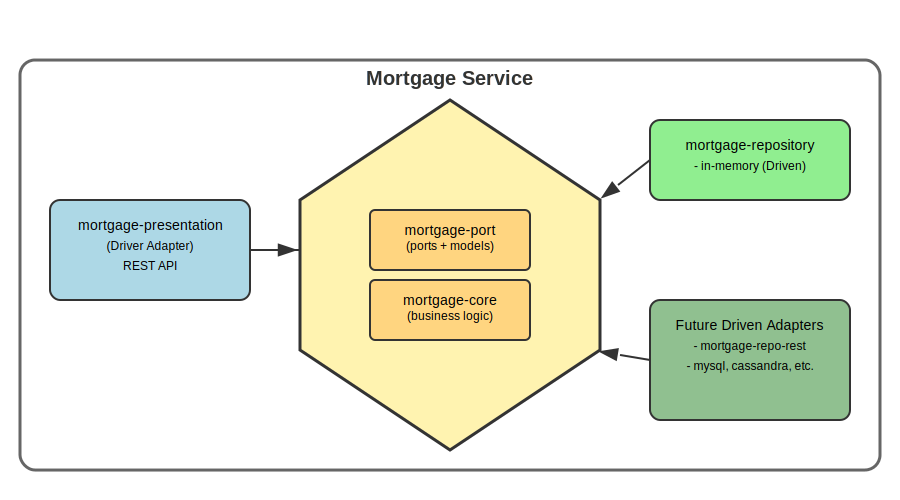

# Mortgage Service
## Prerequisites
- Java 21
- Maven 3.x.x
- Docker (optional, for building docker image)
## Architecture
Mortgage service is a modular spring-boot application. It comprises 4 modules:
- mortgage-port
- mortgage-core
- mortgage-repository
  - mortgage-repository-in-memory 
- mortgage-presentation

All modules only depend on mortgage-port. In mortgage-port we are maintaining all inbound/outbound port interfaces as well as models which will be passed across the modules.

mortgage-core is maintaining the core logic which is basically all mortgage calculation related stuff such as payment calculation, etc.

Mortgage-repository contains driven adapter modules, at the moment only mortgage-repository-in-memory. In the future we might have more counterpart modules such as rest, cassandra, mysql, etc.

Rest endpoints are exposed in mortgage-presentation as a driver adapter module. In the future, we could have other driver modules such as mortgage-stream, etc.



## Build
We can be selective to package specific modules during build. It is useful for 
determining how the final artifact should be crafted. It could be based on specific 
driver and driven adapters. Such as rest with in-memory repository, rest with cassandra 
repository, etc. This will be managed by Maven profiles. At the moment we only have one 
profile which is `mortgage-in-memory`. It will package mortgage-core with 
mortgage-presentation as well as mortgage-repository-in-memory modules.

### build locally
```shell
mvn clean install
```
### build docker image locally
```shell
mvn clean install -Pmortgage-in-memory,docker-build -Ddocker.jib.goal=dockerBuild
```
### build docker image with remote registry
```shell
mvn clean install -Pmortgage-in-memory,docker-build --remote_registry_values
```
## Start docker
```shell
docker run --rm -p 8080:8080 mortgage-service:in-memory-0.0.1-SNAPSHOT
```
## View
### Actuator
http://localhost:8080/actuator

### Swagger UI
http://localhost:8080/swagger-ui/index.html

### Api Spec
json: http://localhost:8080/v3/api-docs

yaml: http://localhost:8080/v3/api-docs.yaml
### Endpoints
Interest rate:
```shell
curl --location 'http://localhost:8080/v1/api/interest-rates' \
--header 'Accept: */*' \
--header 'Cookie: XSRF-TOKEN=beba552e-559f-47cd-9e68-51fe5a95241b'
```

Mortgage check:
```shell
curl --location 'http://localhost:8080/v1/api/mortgage-check' \
--header 'Content-Type: application/json' \
--header 'Accept: */*' \
--header 'Cookie: XSRF-TOKEN=beba552e-559f-47cd-9e68-51fe5a95241b' \
--data '{
  "annualIncome": {
    "currency": "EUR",
    "value": "60000"
  },
  "homeValue": {
    "currency": "EUR",
    "value": "260000"
  },
  "loanValue": {
    "currency": "EUR",
    "value": "240000"
  },
  "maturityPeriod": 30
}'
```
## Load external data
create a yaml file like [this](mortgage-repository/mortgage-repository-in-memory/src/main/resources/application-data.yaml) file and set spring boot additional location property like this: `SPRING_CONFIG_ADDITIONAL_LOCATION: PATH_TO_YAML_FILE`

## Future work
- Add spring security to secure endpoints with jwt token
- Add mortgage-repository-rest module to fetch data from mortgage-service-in-memory via rest api. Then this solution will be scalable with 1 mortgage-service-in-memory and multiple mortgage-service-repository-rest instances.
- Use cache server to cache calculations [here](mortgage-core/src/main/java/com/mostafa/ing/mortgage/core/service/calculator/FixedRateMortgagePaymentCalculatorService.java). It makes the service robuster in scalable environment.